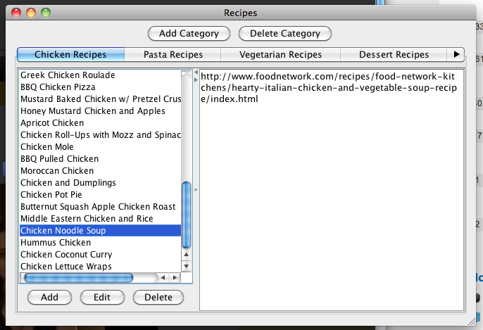
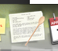

recipe-organizer
================

Several years ago, when I first learned Object-Oriented programming and Java, I set out on a journey. I had like a billion links for recipes on post-it notes and text files on my laptop. When I wanted to find an older recipe, I had to do WAY to much searching. So I decided to make a simple organizer that let me add, edit, and delete recipes in various categories. I didn't know SQL or anything about databases, so I kept all the data in text files.

I wanted to return later when I knew more about programming and improve the UI, add a database, and just clean up the code in general, but I decided to leave it as is. Like as a cute little reminder of where I came from. Kind of like the old macaroni pictures from my childhood. Bon Appetit!

Behold its crappy Java Swing UI glory!!!!

I also made it into a Mac desktop application. Look! It even has a little icon my dock!

